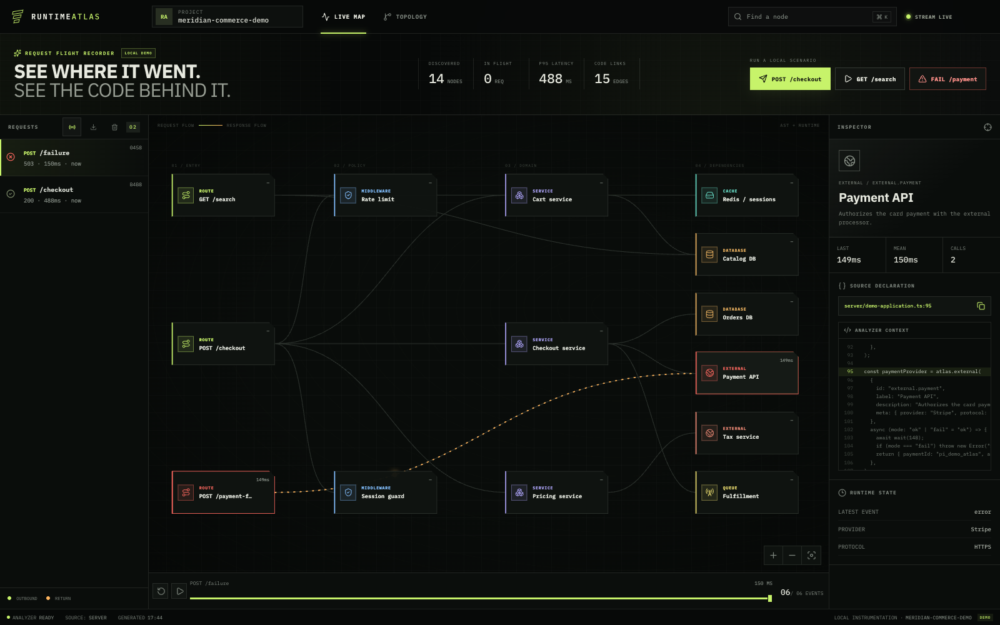

<div align="center">
  
  <h1>Runtime Atlas</h1>
  <p><strong>See where one Node.js request went—and the TypeScript that sent it there.</strong></p>
  <p>
    <a href="https://othmaneblial.github.io/Runtime-Atlas/#live-demo"><strong>Play the guided tour</strong></a>
    · <a href="#run-your-first-trace">Run locally</a>
    · <a href="#instrument-your-app">Instrument your app</a>
    · <a href="https://othmaneblial.github.io/Runtime-Atlas/docs.html">Documentation</a>
  </p>
  <p>
    <a href="https://github.com/OthmaneBlial/Runtime-Atlas/releases/latest"></a>
    <a href="LICENSE"></a>
    
    
  </p>
</div>


Runtime Atlas is a local request flight recorder for Node.js and TypeScript. It derives an explorable map from instrumented source, overlays recent causal trace evidence, and links every proven hop back to the declaration that created it.

Use it while developing to answer one concrete question:

> What path did this request take, where did it slow down or fail, and which code owns each hop?

No account, hosted backend, Kubernetes cluster, service mesh, Prometheus pipeline, or persistent telemetry database is required for the local workflow.

## Run your first trace

Requirements: Node.js 24.15.0 via `nvm` and npm 11.

```bash
git clone https://github.com/OthmaneBlial/Runtime-Atlas.git
cd Runtime-Atlas
nvm install && nvm use
npm ci && npm run dev
```

Open the loopback URL printed by Vite, normally `http://127.0.0.1:5173`, then click **POST /checkout**.

You should see:

```text
✓ 14 source-derived nodes before traffic arrives
✓ 1 checkout trace with 26 ordered runtime events
✓ the active causal path animated across the map
✓ source context, latency, replay, export, and history controls
```

Next, run **FAIL /payment**. Runtime Atlas stops on the failing external span while preserving the parent-child path that reached it.

If either local process cannot start, use the [troubleshooting guide](docs/troubleshooting.md).

## From request to explanation

| 1. Follow the path                                               | 2. Inspect the declaration                                             | 3. Stop on failure                                                                      |
| ---------------------------------------------------------------- | ---------------------------------------------------------------------- | --------------------------------------------------------------------------------------- |
| See the work that actually ran, in causal order.                 | Open analyzer-approved TypeScript beside measured runtime evidence.    | Keep the failed dependency and the route that reached it on one map.                    |
|  |  |  |

The downstream services in the bundled demo are deterministic in-process delays. They generate real causal runtime events, but they do not call Stripe, PostgreSQL, Redis, Kafka, or TaxJar.

## The missing view between code and traces

- **A source diagram shows what may call what.** Runtime Atlas derives that topology from literal `atlas.*` declarations without executing the analyzed project.
- **A trace shows what happened once.** Runtime Atlas preserves parent-child context through sequential and concurrent Node.js work.
- **The live map joins both.** Proven spans light up source-backed nodes; unmatched spans stay visibly runtime-only instead of being presented as known code.
- **Replay makes timing understandable.** Scrub or replay ordered events, inspect latency and failure state, select history, export evidence, or clear the bounded in-memory trace buffer.

Runtime Atlas is deliberately not a production APM replacement. It does not provide durable retention, fleet-wide metrics, log search, alerting, or a multi-tenant hosted service. Use it for developer-time causal comprehension; keep your production observability stack for production operations.

## Instrument your app

Runtime Atlas accepts evidence through a first-party Node.js SDK or a bounded OTLP/HTTP JSON endpoint.

### Path A — workspace Node.js SDK

The SDK is currently a local workspace artifact, not a claimed npm registry release.

```bash
npm run build:sdk
```

Install or link `packages/sdk` into the Node.js service you want to observe, then wrap meaningful boundaries:

```ts
import { createAtlas } from "@runtime-atlas/sdk";

const atlas = createAtlas({
  serviceName: "orders-api",
  collectorUrl: "http://127.0.0.1:4319",
});

const ordersDb = atlas.database(
  { id: "db.orders", label: "Orders DB", meta: { engine: "PostgreSQL" } },
  async () => saveOrder(),
);

const createOrder = atlas.route(
  { id: "route.orders", label: "POST /orders" },
  async () => ordersDb(),
);
```

Point static analysis at the same source tree:

```bash
ATLAS_SOURCE_GLOB='../orders-api/src/**/*.ts' \
ATLAS_PROJECT_NAME='orders-api' \
npm start
```

The analyzer recognizes literal `atlas.route`, `middleware`, `service`, `database`, `cache`, `external`, and `queue` calls, including declarations inside factories. See the [complete framework-neutral example](examples/instrumented-orders.ts) and [SDK reference](packages/sdk/README.md).

### Path B — OpenTelemetry

Send **OTLP/HTTP JSON traces** to the exact endpoint:

```text
http://127.0.0.1:4319/v1/traces
```

Try the standards-shaped fixture:

```bash
curl --request POST http://127.0.0.1:4319/v1/traces \
  --header 'content-type: application/json' \
  --data-binary @examples/otlp-trace.json
```

Runtime Atlas accepts uncompressed or gzip-compressed JSON. It does not claim OTLP/gRPC or binary Protobuf support. Invalid individual spans produce OTLP `partialSuccess`; malformed envelopes and capacity violations return protobuf-JSON `google.rpc.Status` errors.

## What stays local—and what does not

By default, Runtime Atlas binds to loopback and holds recent traces only in process memory. It includes no accounts, analytics, cookies, advertising, or automatic disk persistence.

It intentionally does not retain request bodies, database statements, query strings, URL fragments, credentials, or arbitrary OTLP attributes. Source inspection is analyzer-allowlisted and defaults off when the server binds beyond loopback.

Shared deployments still need TLS and viewer authentication at a trusted reverse proxy. The collector supports bearer authentication, bounded request bodies and span counts, concurrency and rate limits, bounded event history, structured logs, readiness checks, and graceful shutdown.

Read [Privacy and data handling](docs/privacy.md), [Deployment](docs/deployment.md), and [Architecture](docs/architecture.md) before using real application traces.

## Production and Docker

```bash
npm ci
npm run build
NODE_ENV=production npm start
```

Open `http://127.0.0.1:4319`. `GET /health` checks process liveness; `GET /ready` also verifies topology analysis and the built UI.

Or run the hardened loopback-only container profile:

```bash
docker compose up --build
```

The container runs as an unprivileged user with a read-only filesystem. Mount analyzed application source read-only and configure `ATLAS_SOURCE_GLOB` for non-demo use.

## Development contract

```bash
npm run check
```

The canonical gate formats and lints, type-checks, runs 53 unit/component/integration tests, builds the SDK/server/UI, validates six desktop/mobile browser journeys, runs an axe accessibility audit, checks documentation and package contents, and performs real HTTP success/failure smoke scenarios with entry-asset budgets.

Useful focused commands:

```bash
npm test                 # unit, component, and integration tests
npm run test:e2e         # Chrome desktop + Pixel 7 product journeys
npm run screenshots      # regenerate and sync browser-validated captures
npm run smoke            # compiled production HTTP scenarios
npm audit --omit=dev --audit-level=high
docker build --tag runtime-atlas:local .
```

Automatic GitHub Actions runs are temporarily paused while the project is being reworked. The same complete gate remains available locally and through manual workflow dispatch.

## Current scope and roadmap

Runtime Atlas v0.1 is an intentionally focused Node.js/TypeScript developer tool. The next adoption work is visible and bounded:

- publish the SDK with registry provenance after its public API is stabilized;
- add framework adapters only where they reduce boilerplate without hiding causal behavior;
- add focused fixtures for community-requested frameworks and runtime-only OpenTelemetry reconciliation;
- evaluate opt-in durable history only with explicit retention, deletion, and privacy guarantees.

## Contributing

Bug reports, focused feature proposals, framework fixtures, documentation improvements, and adapter experiments are welcome. Start with [Contributing](CONTRIBUTING.md), use the structured [issue forms](.github/ISSUE_TEMPLATE), and run `npm run check` before opening a pull request.

Security reports belong in the private process described in [SECURITY.md].

## Reference

- [Interactive showcase](https://othmaneblial.github.io/Runtime-Atlas/)
- [Full documentation](https://othmaneblial.github.io/Runtime-Atlas/docs.html)
- [Architecture](docs/architecture.md)
- [Privacy and data handling](docs/privacy.md)
- [Deployment](docs/deployment.md)
- [Troubleshooting](docs/troubleshooting.md)
- [Release notes](https://github.com/OthmaneBlial/Runtime-Atlas/releases/latest)
- [Changelog](CHANGELOG.md)

## License

[MIT](LICENSE) © 2026 Othmane BLIAL
