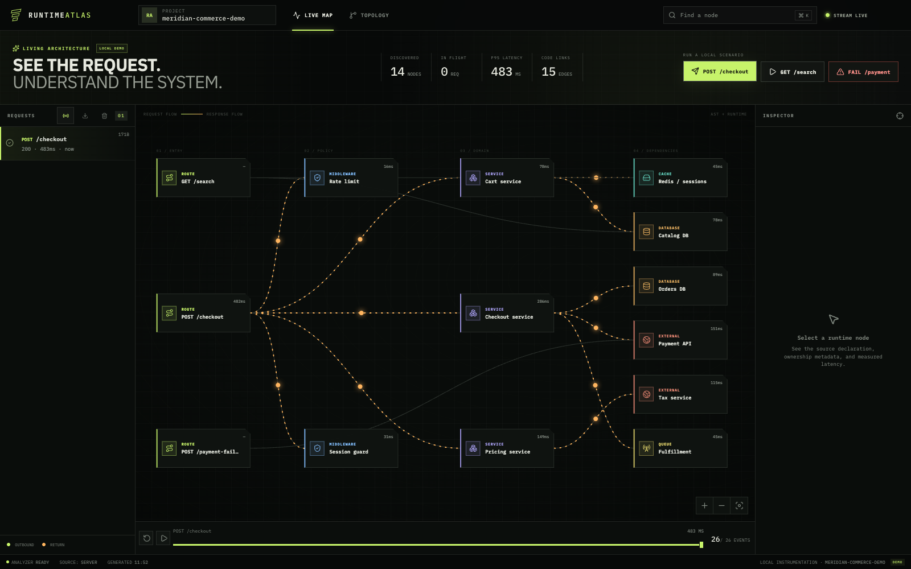
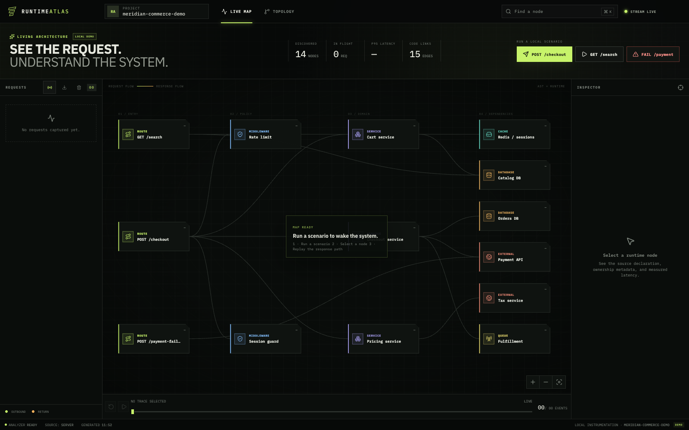
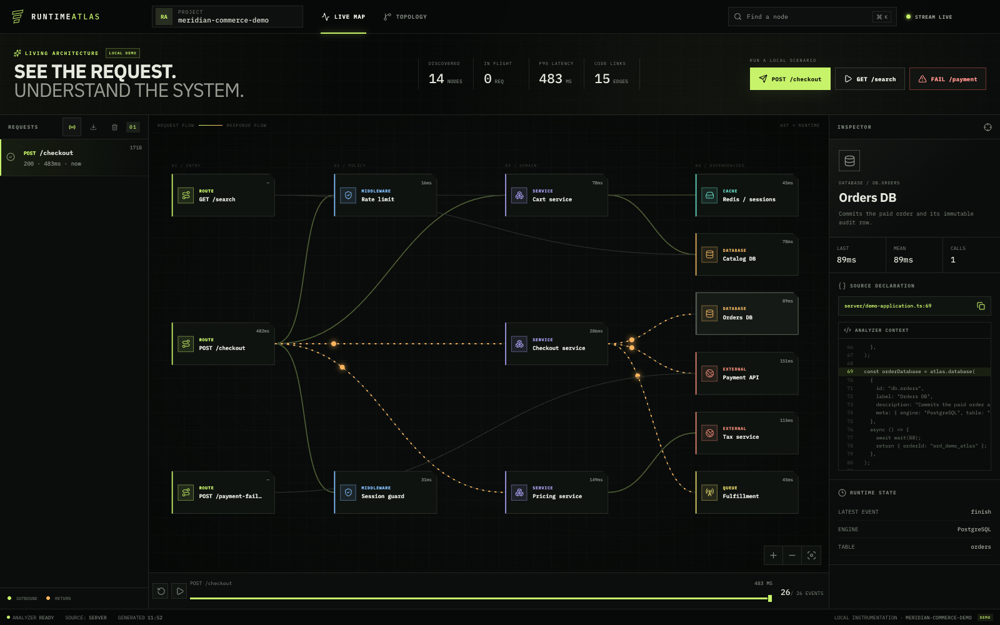
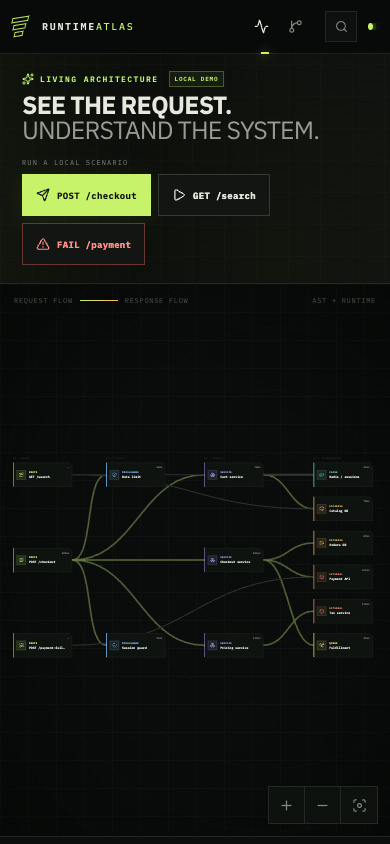

# Runtime Atlas

[](LICENSE)


Runtime Atlas turns TypeScript declarations and recent trace evidence into a live, source-backed application map. Watch one request cross routes, middleware, services, databases, caches, queues, and external APIs; inspect the exact declaration behind a node; then replay the causal path event by event.

It is a local-first developer tool: no account, hosted backend, analytics, or persistent telemetry database is included.



## Why it is different

- **Static evidence:** `ts-morph` finds literal `atlas.*` declarations, call relationships, metadata, and exact source locations without executing the analyzed project.
- **Runtime evidence:** Node.js `AsyncLocalStorage` preserves parent/child spans across sequential and concurrent work.
- **Two ingestion paths:** use the small first-party Node SDK or send existing OTLP/HTTP JSON traces to `/v1/traces`.
- **Honest reconciliation:** live spans that cannot be proven against source appear as visibly runtime-only nodes.
- **Operational bounds:** trace history, event buffers, SDK queues, OTLP bodies/spans, concurrency, and request rates are configurable and bounded in memory.
- **Useful failure states:** the built-in local demo includes deterministic checkout, search, and dependency-outage scenarios.

The built-in downstream operations are simulated delays inside the local process. They create real causal runtime events, but they do not call Stripe, PostgreSQL, Redis, Kafka, or TaxJar.

## Product tour

### Start from the architecture derived from code



### Inspect runtime evidence at the exact declaration



### Keep the live map usable on a narrow screen



## Quick start

Requirements: Node.js 24.15.0 (pinned in [`.nvmrc`](.nvmrc)) and npm 11.

```bash
nvm install
nvm use
npm ci
npm run dev
```

Open the loopback URL printed by Vite (`http://127.0.0.1:5173` when that port is available). The static topology appears immediately. Run **POST /checkout**, **GET /search**, or **FAIL /payment** to create live traces, then select history, scrub replay, inspect source, export, or clear the in-memory evidence.

The development command runs the API/collector at `127.0.0.1:4319`; Vite starts at `127.0.0.1:5173` or prints the next available port. If startup fails, see [Troubleshooting](docs/troubleshooting.md).

## Production build

```bash
npm ci
npm run build
NODE_ENV=production npm start
```

Open `http://127.0.0.1:4319`. `GET /health` is the liveness check; `GET /ready` also verifies topology analysis and the built UI.

Or run the hardened local container profile:

```bash
docker compose up --build
```

The Compose port is loopback-only and the container filesystem is read-only. See [Deployment](docs/deployment.md) before using a shared environment.

## Instrument another Node.js service

Build the workspace SDK, then install or link `packages/sdk` into the service you want to observe. The package is currently a local workspace artifact rather than a claimed public registry release.

```bash
npm run build:sdk
```

```ts
import { createAtlas } from "@runtime-atlas/sdk";

const atlas = createAtlas({
  serviceName: "orders-api",
  collectorUrl: "http://127.0.0.1:4319",
  maxQueueSize: 2_000,
  requestTimeoutMs: 3_000,
  onError: (error) =>
    applicationLogger.warn({ error }, "atlas collector unavailable"),
});

// Connect/Express compatible. The path callback removes identifiers and query
// strings before telemetry leaves this process.
app.use(
  atlas.httpMiddleware({
    path: (request) =>
      (request.originalUrl ?? request.url ?? "/").replace(
        /\/\d+(?=\/|$)/g,
        "/:id",
      ),
    ignore: (request) => request.url === "/health",
  }),
);

const ordersDb = atlas.database(
  { id: "db.orders", label: "Orders DB", meta: { engine: "PostgreSQL" } },
  async () => saveOrder(),
);

const createOrder = atlas.route(
  { id: "route.orders", label: "POST /orders" },
  async () => ordersDb(),
);

app.post("/orders", async (_request, response) => {
  response.status(201).json(await createOrder());
});
```

The complete framework-neutral example is [examples/instrumented-orders.ts](examples/instrumented-orders.ts). Point Runtime Atlas static analysis at the same source. Comma-separated globs are accepted:

```bash
ATLAS_SOURCE_GLOB='../orders-api/src/**/*.ts' \
ATLAS_PROJECT_NAME='orders-api' \
ATLAS_ENVIRONMENT='development' \
npm start
```

The analyzer recognizes literal calls named `atlas.route`, `atlas.middleware`, `atlas.service`, `atlas.database`, `atlas.cache`, `atlas.external`, and `atlas.queue`, including declarations inside factories. Dynamic descriptors or wrappers that hide those call shapes may appear only as runtime evidence.

For non-loopback ingest, configure the same bearer value at both ends and deliver it through secret environment configuration:

```ts
const atlas = createAtlas({
  serviceName: "orders-api",
  collectorUrl: process.env.ATLAS_COLLECTOR_URL,
  headers: { authorization: `Bearer ${process.env.ATLAS_INGEST_TOKEN}` },
});
```

## Connect OpenTelemetry

Configure an OTLP/HTTP exporter to send **JSON** to the exact traces endpoint:

```text
http://127.0.0.1:4319/v1/traces
```

Binary protobuf and gRPC are intentionally not accepted. Uncompressed and gzip-compressed OTLP JSON are supported. Test the bundled standards-shaped payload with:

```bash
curl --request POST http://127.0.0.1:4319/v1/traces \
  --header 'content-type: application/json' \
  --data-binary @examples/otlp-trace.json
```

Runtime Atlas reconciles complete spans using an explicit `runtime.atlas.node_id`, code provenance, HTTP route evidence, then a bounded inference from protocol and service fields. It does not retain `url.full`, query strings, database statements, bodies, credentials, or arbitrary span attributes. Invalid individual spans produce OTLP `partialSuccess`; malformed envelopes and capacity violations return protobuf-JSON `google.rpc.Status` errors.

## Configuration

Copy [`.env.example`](.env.example) as a reference; the server reads environment variables directly and does not auto-load `.env` files.

| Variable                             | Default           | Purpose                                                         |
| ------------------------------------ | ----------------- | --------------------------------------------------------------- |
| `HOST`                               | `127.0.0.1`       | Listener address; use non-loopback only in a controlled network |
| `PORT`                               | `4319`            | API, collector, SSE, and production UI port                     |
| `ATLAS_SOURCE_GLOB`                  | built-in demo     | Comma-separated TypeScript source globs                         |
| `ATLAS_PROJECT_NAME`                 | demo/project name | Display name, maximum 80 printable characters                   |
| `ATLAS_ENVIRONMENT`                  | `local`           | Displayed environment label                                     |
| `ATLAS_INGEST_TOKEN`                 | unset             | Optional bearer token, minimum 16 characters                    |
| `ATLAS_EXPOSE_SOURCE`                | loopback only     | Enable analyzer-approved source context                         |
| `ATLAS_ALLOW_CLEAR`                  | local demo only   | Enable trace deletion API and control                           |
| `ATLAS_TRUST_PROXY`                  | `false`           | Trust one reverse-proxy hop for client IPs                      |
| `ATLAS_LOG_LEVEL`                    | `info`            | `debug`, `info`, `warn`, `error`, or `silent`                   |
| `ATLAS_OTLP_BODY_LIMIT`              | `8mb`             | Decompressed OTLP JSON limit, 1 KiB–64 MiB                      |
| `ATLAS_OTLP_MAX_SPANS`               | `1000`            | Maximum span groups per OTLP request                            |
| `ATLAS_OTLP_MAX_CONCURRENT_REQUESTS` | `16`              | OTLP conversion concurrency                                     |
| `ATLAS_INGEST_RATE_LIMIT`            | `600`             | Ingest requests per client per minute                           |
| `ATLAS_DEMO_RATE_LIMIT`              | `120`             | Demo requests per client per minute                             |
| `ATLAS_MAX_TRACES`                   | `60`              | In-memory trace retention                                       |
| `ATLAS_MAX_BUFFERED_EVENTS`          | `800`             | SSE replay buffer                                               |
| `ATLAS_MAX_EVENTS_PER_TRACE`         | `5000`            | Per-trace event retention                                       |
| `ATLAS_MAX_RETAINED_EVENTS`          | `50000`           | Aggregate events retained across trace history                  |
| `ATLAS_MAX_STREAM_CLIENTS`           | `100`             | Concurrent SSE clients per process                              |
| `ATLAS_TOPOLOGY_CACHE_MS`            | `2000`            | Static analysis cache duration                                  |
| `ATLAS_SHUTDOWN_TIMEOUT_MS`          | `10000`           | Graceful shutdown deadline                                      |

Invalid configuration fails before the server listens.

## HTTP surface

| Endpoint                  | Purpose                                               |
| ------------------------- | ----------------------------------------------------- |
| `GET /health`             | Lightweight process liveness                          |
| `GET /ready`              | Topology, UI build, and runtime readiness             |
| `GET /api/topology`       | AST-derived topology and enabled capabilities         |
| `GET /api/source`         | Small source window for an analyzer-approved location |
| `GET /api/traces`         | Recent bounded in-memory history                      |
| `GET /api/traces/export`  | Download retained traces as JSON                      |
| `DELETE /api/traces`      | Clear history when enabled                            |
| `GET /api/stream`         | SSE runtime events and heartbeats                     |
| `POST /api/ingest`        | First-party SDK batches                               |
| `POST /v1/traces`         | OTLP/HTTP JSON traces                                 |
| `POST /api/demo/checkout` | Deterministic success trace                           |
| `GET /api/demo/search`    | Smaller shared-infrastructure trace                   |
| `POST /api/demo/failure`  | Deterministic dependency failure                      |

Every response receives a request ID and restrictive browser security headers. API errors use a stable JSON envelope; OTLP errors use the protocol status shape.

## Validation

```bash
npm run check
```

The command checks formatting and lint, type-checks, runs unit/component/integration tests, builds the SDK/server/UI, runs the compiled product in Chrome at desktop and mobile viewports, performs a real-browser axe audit, verifies required repository files and common credential signatures, checks local documentation links and SDK tarball contents, then exercises both success and failure scenarios over HTTP. The production smoke test reports measured startup and checkout time and enforces 100 KiB JavaScript / 20 KiB CSS gzip entry-asset budgets.

Useful focused commands:

```bash
npm test
npm run test:e2e
npm run typecheck
npm run lint
npm run build
npm run smoke
npm run screenshots
npm audit --omit=dev --audit-level=high
docker build --tag runtime-atlas:local .
```

`npm run test:e2e` builds the production application, starts an isolated local server, and validates Chrome desktop plus a Pixel 7 viewport. It fails on unexpected console errors, page exceptions, failed requests, HTTP errors, accessibility violations, or mobile horizontal overflow. `npm run screenshots` regenerates the four browser-validated images in `docs/assets`; both commands require a current Google Chrome installation.

## Repository map

| Path            | Responsibility                                                                                               |
| --------------- | ------------------------------------------------------------------------------------------------------------ |
| `server/`       | Express application, configuration, AST analyzer, OTLP conversion, runtime retention, and deterministic demo |
| `src/`          | React workspace, live topology reconciliation, replay, inspector, and interaction tests                      |
| `e2e/`          | Playwright desktop/mobile product journeys and real-browser accessibility checks                             |
| `packages/sdk/` | Framework-neutral Node.js instrumentation package and transport                                              |
| `shared/`       | API/event contracts shared by server and UI                                                                  |
| `examples/`     | First-party SDK and standards-shaped OTLP examples                                                           |
| `fixtures/`     | Static-analysis test applications                                                                            |
| `scripts/`      | Documentation validation and compiled production smoke/performance checks                                    |
| `docs/`         | Architecture, privacy, deployment, troubleshooting, and release guidance                                     |

## Compatibility target

- Node.js `^22.22.2`, `^24.15.0`, or `>=26`; Node 24.15.0 is pinned for development and CI.
- npm 11.12.1, recorded through `packageManager` and the lockfile.
- macOS and Linux development environments; CI verifies Ubuntu and the production container uses Debian Bookworm.
- Docker Engine with the Compose v2 plugin for the included container workflow.
- Current evergreen browsers with ES modules, SVG `foreignObject`, Server-Sent Events, and CSS `color-mix()` support. Playwright continuously verifies current Chrome at desktop and Pixel 7 viewports; the release checklist retains Firefox and Safari as manual cross-browser gates.

## Security, privacy, and limitations

Runtime Atlas binds to loopback by default and keeps trace data only in process memory. It has collector bearer authentication but no dashboard user accounts. Shared deployments require TLS and authentication at a trusted reverse proxy. Source inspection can reveal proprietary code; trace exports can contain internal architecture and error evidence.

This project is not a durable tracing database, cross-replica store, metrics/logs platform, or public multi-tenant service. Service clock skew can affect event timing within externally collected traces. Static analysis intentionally favors provable literal TypeScript call shapes over speculative inference.

- [Architecture](docs/architecture.md)
- [Privacy and data handling](docs/privacy.md)
- [Deployment](docs/deployment.md)
- [Troubleshooting](docs/troubleshooting.md)
- [Security policy](SECURITY.md)
- [Contributing](CONTRIBUTING.md)
- [Release checklist](docs/release-checklist.md)

## Focused roadmap

- Publish the SDK with registry provenance once its public API is intentionally stabilized.
- Add framework-specific adapters only where they reduce instrumentation boilerplate without hiding causal behavior.
- Evaluate an opt-in durable history adapter only with explicit retention, deletion, and privacy guarantees; the default remains local and in-memory.

## License

[MIT](LICENSE) © 2026 Othmane BLIAL
