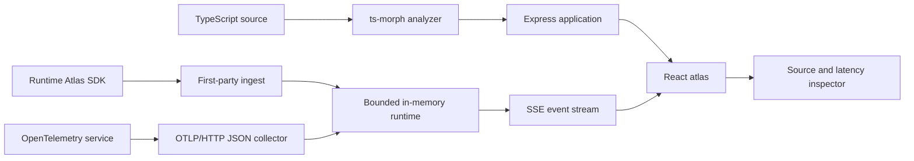

# Architecture

Runtime Atlas combines static TypeScript evidence with bounded runtime evidence. Neither source is presented as a complete distributed tracing backend: the static graph describes declared relationships, while live events prove the path of a specific recent request.

## Static topology

`server/analyzer.ts` loads configured TypeScript globs through `ts-morph`. It discovers `atlas.route`, `atlas.middleware`, `atlas.service`, `atlas.database`, `atlas.cache`, `atlas.external`, and `atlas.queue` declarations anywhere in the source tree, including inside application factories. Literal descriptor IDs, labels, metadata, and exact source locations become nodes. Handler call sites become directed edges.

The analyzer rejects duplicate node IDs and an excessive source-file set. It deliberately does not execute the analyzed application. Dynamic names or wrappers that hide the literal `atlas.*` call cannot be proven statically and may appear only when runtime evidence arrives.

## Runtime model

`AtlasRuntime` and `@runtime-atlas/sdk` use Node.js `AsyncLocalStorage` to carry trace and parent-span context through concurrent promises. A trace contains ordered lifecycle events:

1. `trace:start`
2. zero or more causal `span:start`, `span:finish`, and `span:error` events
3. `trace:finish`

The server assigns an increasing collector sequence. The UI uses that sequence rather than service clocks to select the newest evidence. Trace history, buffered events, per-trace events, SDK queues, OTLP spans, request bodies, and concurrency are all bounded.

## OpenTelemetry reconciliation

The OTLP converter accepts OTLP/HTTP JSON at `/v1/traces`. It maps complete spans to static nodes in this order:

1. explicit `runtime.atlas.node_id`;
2. code function or exact file/line provenance;
3. HTTP method and route;
4. a runtime-only node inferred from stable protocol fields and a small allowlist of database, messaging, service, and code metadata.

Unrecognized attributes are discarded. Runtime-only nodes are visually distinguished because they are observed evidence without a matching declaration.

## HTTP application

`server/app.ts` is an application factory so integration tests can bind it to an ephemeral port. It owns API validation, collector authentication, rate limits, security headers, source allowlisting, static asset caching, readiness, the local demo, and the SPA fallback. `server/index.ts` is the process boundary: configuration, structured logging, socket tracking, and graceful `SIGINT`/`SIGTERM` shutdown.

## Frontend

The React client bootstraps topology and retained traces, then subscribes to SSE. It reconciles newly observed runtime nodes and edges, follows the newest request until the user pins history, and calculates the visible state from a replay cursor. Source inspection is requested only for a location returned by the analyzer.

The built-in demo is intentionally deterministic. Database, cache, queue, tax, and payment operations are simulated delays inside the local process; they are not claims about live third-party systems.
